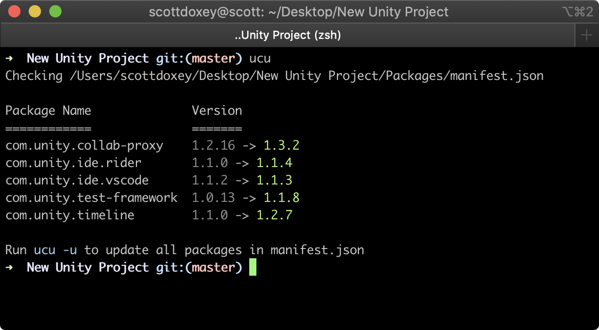

# unity-check-updates

> 🔧 Command line tool for updating UPM packages.

[](https://www.npmjs.org/package/unity-check-updates)



## Install

```bash
$ npm install -g unity-check-updates
```

## Usage

### Check packages for updates

```bash
$ ucu
```

### Update packages to latest

```bash
$ ucu -u
```

## Help

```bash
  Command line tool for updating UPM packages.

  Usage
    $ ucu [options]
  Options
  --update, -u         Updated all packages to latest.
  --packageFile, -p    Package file path. (Default: Packages/manifest.json)
  --allowPreview, -a   Allow preview packages.
  --help, -h           Display this help message.
  --version, -v        Display the current installed version.
```

## API

### `await unityCheckUpdate(string path[, object options])`

```javascript
(async () => {

    const results = await unityCheckUpdates(path);

    console.log(results);

})();
```

### `updateDependencies(string path, object[] results)`

```javascript
updateDependencies(path, [{
    currentVersion: '1.1.0',
    dependency: 'com.unity.ide.rider',
    nextVersion: '1.1.4'
}]);
```
